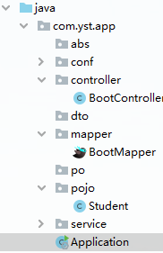
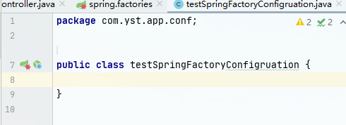
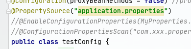

## Springboot


**springboot是为简化spring开发而生的框架**


### 解决的问题

spring整合SSM架构的痛点,需要写大量的庞杂的配置类,配置文件,需要解决依赖的各种版本冲突.springboot推出默认配置,依赖管理,简化开发.


### springboot几大特征

#### 1.parent标签

说明自己的父模块是谁,将spring-boot-starter-parent设为整个项目的**父模块**.

```xml
<parent>
   <groupId>org.springframework.boot</groupId>
   <artifactId>spring-boot-starter-parent</artifactId>
   <version>2.4.8</version>
</parent>
```

这个spring-boot-starter-parent里面涵盖了很多**内嵌依赖**,其中一个就是spring-boot-dependencies,也就是**自动版本管理**,还有一个是spring-boot-autoconfigure也就是**自动配置**


#### 2.spring-boot-dependencies依赖管理

可以不引入springboot的parent依赖,但是引入spring-boot-dependencies,这个依赖可以帮其它starter依赖进行自动依赖管理如:*spring-boot-starter-web*,这个web依赖内嵌了tomcat,jetty等网络服务器的依赖,spring-boot-starter依赖,spring-webmvc依赖.*spring-boot-starter-web*可以自动解决这些内嵌依赖的版本管理,自动找到最优的版本搭配.

```xml
<dependency>
    <groupId>org.springframework.boot</groupId>
    <artifactId>spring-boot-dependencies</artifactId>
    <version>${spring-boot.version}</version>
    <type>pom</type>
    <scope>import</scope>
</dependency>
```


#### 3.启动类Application

注意点

1.application启动容器,只能将这个包的bean放入容器,所以它放置的位置是

2.@SpringBootApplication注解,将这个类变成启动类,@ComponentScan()是将某个包中的类都放进容器,前提是你写这个标注是个配置类,@MapperScan()是将某个包下的类标记成@Mapper放入容器.

```java
package com.yst.app;

import org.mybatis.spring.annotation.MapperScan;
import org.springframework.boot.SpringApplication;
import org.springframework.boot.autoconfigure.SpringBootApplication;

/**
 * @creator: ly-yangst
 * @date: 2022/6/28
 */
@SpringBootApplication
@MapperScan("com.yst.app.mapper")//将本路径下所有类加上@Mapping
public class Application {
    public static void main(String[] args) {
        SpringApplication.run(Application.class,args);
    }
}
```

 SpringApplication.run(Application.class,args);可以实例化成一个对象,操作这个对象,相当于操作容器.如

```java
public static void main(String[] args) {
    ConfigurableApplicationContext applicationContext = SpringApplication.run(AppApplication.class, args);

    DataSource dataSource = applicationContext.getBean(DataSource.class);
    System.out.println(dataSource);//测试@Bean 注入的datasource
}
```

这里有一个args,是一个参数,可填可不填.


#### 4.spring.factory

以下就是spring.factory,将com.yst.app.conf.testSpringFactoryConfigruation这个类变成配置类

```factory
#Initializer 初始化器 在还没开启容器时就注入一些bean
org.springframework.boot.autoconfigure.SharedMetadataReaderFactoryContextInitializer

# Auto Configure
org.springframework.boot.autoconfigure.EnableAutoConfiguration=\
  com.yst.app.conf.testSpringFactoryConfigruation,\
  com.yst.app.conf.configBean.initializerTest
```

所以,.testSpringFactoryConfigruation这个类,不用写@Configuration就能变成配置类,而且它的优先级高于@Configuration,容器启动时先扫描spring.factory,再扫描@Configuration



SharedMetadataReaderFactoryContextInitializer是初始化器,

```java
package com.yst.app.conf;

import com.yst.app.conf.configBean.initializerTest;
import org.springframework.context.ApplicationContext;
import org.springframework.context.ApplicationContextInitializer;
import org.springframework.context.ConfigurableApplicationContext;

/**
 * 初始化器
 * @creator: ly-yangst
 * @date: 2022/6/26
 */
public class YstApplicationContextInitializer implements ApplicationContextInitializer {
    //还没开启容器,就注入一些bean
    @Override
    public void initialize(ConfigurableApplicationContext applicationContext) {
        //getBeanFactory()表示从spring.factorys文件中去拿,而getBean是拿不到的
        applicationContext.getBeanFactory().registerSingleton("yst",new initializerTest());
    }
}
```


## springboot整合三方依赖(SSM架构)

### 1.整合web

web内嵌tomcat,jetty,springMvc,整合web就是整合springMvc

```xml
<!--web 依赖，让项目启动之后具备接收请求，返回响应的能力-->
<dependency>
    <groupId>org.springframework.boot</groupId>
    <artifactId>spring-boot-starter-web</artifactId>
</dependency>
```

或者排除掉tomcat,顺延使用jetty做网络服务器

```xml
<dependency>
    <groupId>org.springframework.boot</groupId>
    <artifactId>spring-boot-starter-web</artifactId>
    <exclusions>
        <exclusion>
            <groupId>org.springframework.boot</groupId>
            <artifactId>spring-boot-starter-tomcat</artifactId>
        </exclusion>
    </exclusions>
</dependency>
```


### 2.整合jdbc

```xml
<dependency>
    <groupId>org.springframework.boot</groupId>
    <artifactId>spring-boot-starter-jdbc</artifactId>
</dependency>
```

当然还要mysql或者其它数据库的连接

```xml
<dependency>
    <groupId>mysql</groupId>
    <artifactId>mysql-connector-java</artifactId>
</dependency>
```

### 3.整合mybatis

```xml
<!--boot 整合mybatis-->
<dependency>
    <groupId>org.mybatis.spring.boot</groupId>
    <artifactId>mybatis-spring-boot-starter</artifactId>
    <version>2.1.4</version>
</dependency>
```

```xml
<dependency>
    <groupId>mysql</groupId>
    <artifactId>mysql-connector-java</artifactId>
</dependency>
```

### 4.整合mybatis-plus

```xml
<dependency>
    <groupId>com.baomidou</groupId>
    <artifactId>mybatis-plus-boot-starter</artifactId>
    <version>3.2.0</version>
</dependency>
```

```xml
<dependency>
    <groupId>mysql</groupId>
    <artifactId>mysql-connector-java</artifactId>
</dependency>
```

当然还要配置文件

```yml
server:
  port: 80
  jetty:
    threads:
      max: 500
spring:
  profiles:
    active: dev  # profiles.active: 指定目前所处环境,用这个可以切换环境,从而使不同配置生效
  datasource:
    type: com.alibaba.druid.pool.DruidDataSource
    url: jdbc:mysql://192.168.41.188:3306/test411?useUnicode=true&characterEncoding=UTF-8&serverTimezone=UTC
    username: root
    password: root
    driver-class-name: com.mysql.cj.jdbc.Driver
```


上述三个整合,有了plus就不用mybatis,有了mybatis就不需要jdbc,包含了

注意spring-boot-starter-xxx与xxx-spring-boot-starter的区别,前者可以**自动化版本配置**不用写版本号,后者没有**自动化版本配置**,需要写版本号


至此,SSM架构的sping,springMvc,mybatis就构建好了


## Springboot注解

@SpringBootApplication 启动类

@Repository 持久层

@Service 业务层

@RestController = @ResponseBody+@Controller

@RequestParam  将get的单个参数进行映射

@RequestBody  将json转为对象

```java
@PostMapping("/users")
public ResponseEntity<User> createUser(@Valid @RequestBody UserCreateRequest userCreateRequest) {
 return userRespository.save(user);
}
```

@ResponseBody 进行model到json等数据的相互转化,装入body返回

@SpringBootConfiguration 继承@Configuration,功能一致,标记为配置类,并将一个或多个@Bean标记的bean放入容器

@PropertySource 导入配置文件

@RequestMapping("user") 拦截请求

@GetMapping

@PathVariable 路径传参

```java
 @RequestMapping("/adminDetele/{id}")
public String adminDetele(@PathVariable("id") int id){        loginService.adminRecovery(id);        loginService.adminDetele(id);                                return "redirect:/admin/adminDelList-del";
 }
```

@Resource

@Autowired 

两者都可以装配bean,@Resource默认按照名称方式进行bean匹配，@Autowired默认按照类型方式进行bean匹配

@Transactional

声明事务，可以添加在类上或者方法上.在spring boot中 不用再单独配置事务管理，一般情况是我们会在servcie层添加了**事务注解**，即可开启事务。要注意的是，事务的开启只能在public 方法上

@ControllerAdvice

controller增强,@RestControllerAdvice 是 @ControllerAdvice 和 @ResponseBody的合集，可以将异常以json的格式返回数据

@Scope   作用域 单例

```java
@Bean
@Scope("singleton")
public Person personSingleton() {
  return new Person();
}
```

